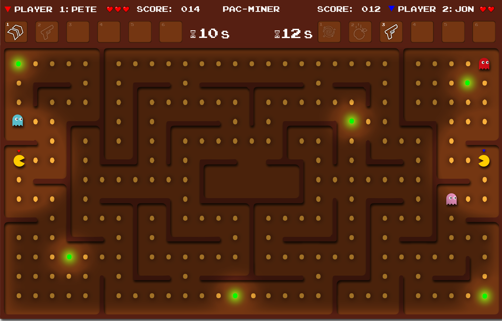

# Group 13 Game Project

## Members

Finn Lawton,
Haolan Zhao,
Daniel Parschau,
Yunpeng Yang,
Chao Gao

## Game idea 1 : Battle of the Tanks

In this game, one or two players manipulate their tanks to
protect the eagle against AI-controlled enemy tanks.
The map contains different kinds of walls and floors.
And there are various kinds of sporadic buffs.

**Twist:**
We can change it into a network versus game.
Two players battle against each other and AI tanks are
also divided into two sides.

**Challenges:**

- network communication
- collision detection
- AI tanks

**Paper Prototype Link**
<https://youtu.be/0xlvFs2NJCI>

## Game idea 2 : Multiplayer Pac-Man

Experience the thrill of navigating a cute yellow character
through a maze filled with snacks and four pursuing ghosts.
The objective is simple: consume all the snacks to advance
to the next level while avoiding or temporarily turning the
tables on the ghosts by consuming power-up snacks.

### Unique Twist

This version introduces multiple game modes and novel
power-upsto enhance gameplay significantly.

#### Game Modes

- **Single Player (Classic)**: Play as Pac-Man with
  AI-controlled ghosts.
- **Single Player (Ghost Mode)**: Control one or all of the
  ghosts with a switching mechanism.
- **Collaborative Multiplayer**: Team up with other players
  as Pac-Men working together to achieve a cumulative high
  score. Ghosts will target the nearest player.
- **Competitive Multiplayer (Pac-Man vs. Pac-Man)**:
  Multiple players compete against each other as Pac-Men.
- **Competitive Multiplayer (Pac-Man vs. Ghosts)**:
  A human-controlled Pac-Man faces off against multiple
  human or AI-controlled ghosts.

#### Power-ups

Enhance your gameplay with power-ups that can be activated
on yourself or your opponents:

- **Long-Distance Weapons**: Attack from afar, similar to a
  tank game.
- **Spawn Rate Alteration**: Change how frequently ghosts
  appear.
- **Opponent Control**: Temporarily take control of your
  opponent's Pac-Man.
- **Map Inversion**: Transform walls into tunnels and vice
  versa.
- **Size Modification**: Decrease your size to dodge ghosts
  or increase an opponent's size to get them stuck.
- **Tunneling**: Move instantly to another side of the maze
  to escape danger.
- **Trap Setting**: Leave traps for ghosts or other players,
  slowing them down upon activation.
- **Iceblocks**: Create iceblocks behind you, obstructing
  movement for opponents or ghosts.
- **Ghost Magnet**: Attract all ghosts to a specific
  location, diverting their focus.
- **Speed Surge**: Boost your speed temporarily for quick
  escapes or pursuits.
- **Power Snack Duplicate**: Power snacks spawn duplicates
  randomly, offering more power-up opportunities.
- **Teleport**: Escape to a random maze location instantly.
- **Time Freeze**: Freeze ghosts and possibly players,
  facilitating safe movement or consumption.
- **Ghost Disguise**: Appear as a ghost to other players,
  avoiding conflict.
- **Ghost Repellent**: Repel ghosts with a temporary barrier
  around your character.

**Challenges:**

- AI ghosts
- Online multiplayer
- Generated terrains
- Game mode tutorial

**Paper Prototype Link**
https://youtu.be/RZP7WlMi2Jo

## Final choice: Pac-man but it's an online multiplayer game

### Overview

Welcome to Multiplayer Pac-man, a thrilling game that pits
two players against each other on a traditional Pac-man map
with an exciting twist: the ability to break through walls.
Dive into a head-to-head competition to collect as many
points as possible while navigating through a maze filled
with challenges and surprises.

### Gameplay

### Description

Players aim to gather as many points as possible by
collecting coins scattered throughout the map. Each player
starts with 3 lives, and the goal is to avoid ghosts while
trying to outscore your opponent.

### Key Features

- **Dynamic Maze:** Navigate through a classic Pac-man maze,
  enhanced with the ability to temporarily destroy barriers
  and ghosts.
- **Ghostly Opposition:** Avoid ghosts that chase you
  through the maze, trying to deplete your lives. If caught,
  players respawn at their original position, adding a
  strategic layer to the gameplay.
- **Transform into a Ghost:** In a twist of fate, if a
  player loses all their lives, they reappear as a ghost,
  aiming to chase down the opposing player and limit
  their score.
- **Power-ups:** Collect uniquely colored coins to gain
  one-off abilities, adding depth and strategy to the game.

### Storyline

### Tank-man

Little Packie lived a happy life in his candy palace, until
one day … Some powerful ghosts invaded his palace and
created a mirror image of him, eating his precious candies!

“Oh no! I’m gonna destroy you with all my abilities!
Let me be a TANK MAN!” So a mighty power growed inside
Packie and he became powerful Tankie, with some
destructive strength.

### Pac-miner

After years of evading ghosts on arcades, Pac realises the
only safe place really might just be underground!
He ventures into the caves, only to find another Pac-man
with the same idea.

As they compete for resources, they discover that the
ghosts have followed them below. Armed with their pickaxes
and a torch illuminating their surroundings the two pacmen
must find a way to survive this subterranean nightmare...
for as long as they can.

Join us in this reimagined Pac-man adventure, where
strategy, agility, and a bit of luck will determine the
victor. Are you ready to break through walls and
claim victory?

Alternatively, complete dark mode:

## Game Requirements:
### Stakeholders:
- player
- lecturers (markers)
- developer
- customers
- negative stakeholders: school

### 2. user stories
- as a player, I want to play against someone else so that
I can spend time with my friend.
- as a player, I want to get the highest score so that I 
can win.
- as a player, I want to have directions on the game so I 
know how to play.
- as a developer, I want to know how to work together with
a team so that we can code together.
- as a lecturer, I want to be able to learn and play the 
game in five minutes so that I have a good understanding 
of the game

### Use case specification
User story: as a player, I want to play against someone 
else so that I can spend time with my friend.
1. the user (1st player) clicks the button which creates 
the game to get a room number.
2. the 1st player shares the room number with their 
friend (2nd player).
3. 2nd player enters number in the box on their computer 
to join the game
4. the 2nd computer sends message through internet to 
first computer to connect game.
5. 1st player chooses the mode and press start.
6. now both users are playing on the same game.
7. the screen updates when players collect points and 
power ups.
8. when the first player dies, the game updates and turns 
the player into a ghost.
9. when the second player dies, the leaderboard comes up 
and shows the final points.
10. there is an option to start a new game.
