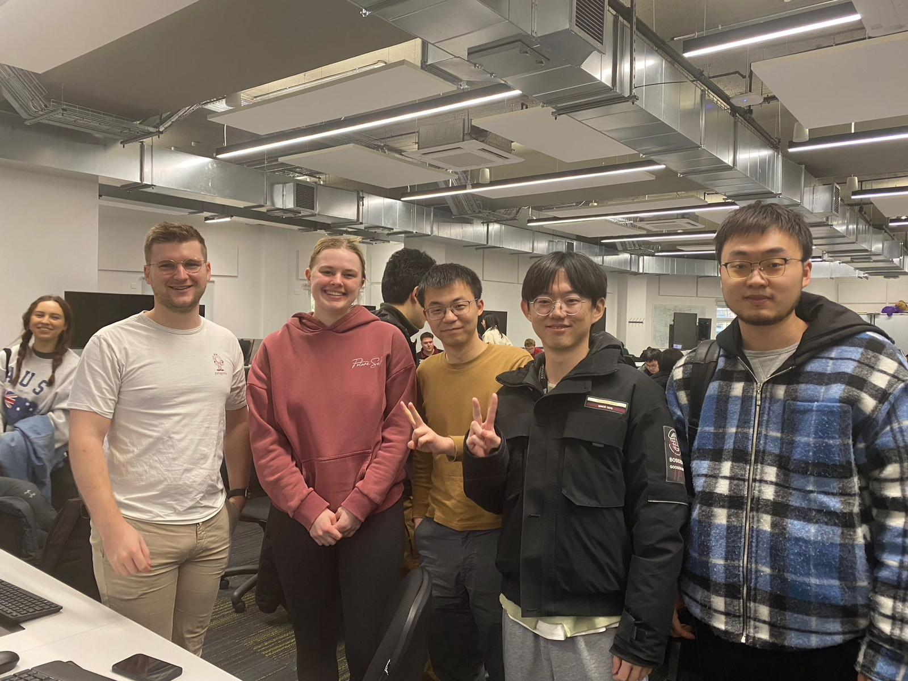

# Group 13 Game Project

## Members

Finn Lawton,
Haolan Zhao,
Daniel Parschau,
Yunpeng Yang,
Chao Gao

## Project Kanban Board

[Kanban](https://github.com/orgs/UoB-COMSM0110/projects/62)

## Introduction
Text

---

## Requirements
Text

---

## Design
Text

---

## Implementation
Text

---

## Evaluation

### Qualitative Evalutations
We first did three types of qualitative evaluations at different points of the development process in order to have constant feedback and help navigate the final product design. This section will highlight the main results from the think aloud evaluation, heuristic evaluation and focus group.

#### Think Aloud Evaluation 11/03/2024

#### Heuristic Evaluation {DATE}

#### Focus Group 09/05/2024
Based off additional research, we found that hosting a focus group would provide further feedback. In this 40 minute session we asked the following quetions:

*How did you find playing the game?*
> P1 - Pretty good.

> P2 - I liked the traditional game play of Pac-Man but it was good to have the competition between players.

> P3 - Really cool, I really liked it.

*What is the twist on the game?*
> P2 - Playing multiplayer.

> P3 - That you can shoot through the walls and it’s underground.

*Was there anything you expected to find that was not there?*
> P4 - I think having a list of power ups would be good.

> P1 - Sound effects would make it more engaging.

> P5 - No I don’t think so, maybe more help information on controls

*What was difficult or strange about the game?*
> P1 - Seeing the fps, I have no idea what that was. Also it was not difficult enough.

> P5 - I thought it was difficult working out what the green things do.

> P2 - Getting movement stuck, is this because of powerups?

> P4 - Ghosts can get away by going through walls and the ghosts are a lot smaller than the path which makes it easier to escape them.

> P3 - I agree, but I guess that could be the twist.

*What did you like about the game?*
> P2 - Everything.

> P3 - All worked pretty well, reappearing coins was good, the competitive version was good, and looked pretty professional.

> P5 - It’s fun to play, I like this version of Pac-Man

*Visually, was there anything that did not look the way you expected?*
> P1 - Ghosts moving randomly through the walls, have mining features but more bright colours.

> P2 - I would change the font on the help page, I liked it for the titles and labels but it was difficult to read the help instructions.

*What is one thing you would change about the game?*
> P1 - Choice of avatar colour. Also to get more points if you kill a ghost or the other player.

> P3 - I agree, or maybe even making them different colours so you don’t get mixed up between them

> P4 - I agree, also possibly a way to pause the game.

> P5 - I think it would be good to have the help instructions when you press ‘start game’ so you are forced to read it.

### Quantitative Evaluations

### How our code was tested

---

## Process
Text

---

## Conclusion