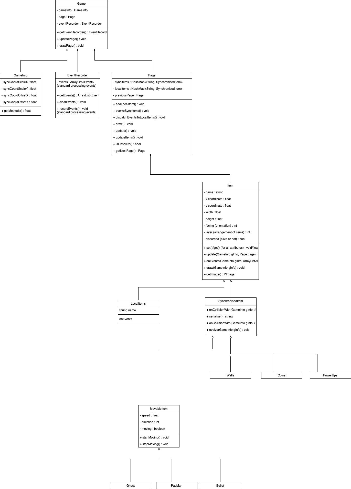

## Table of Contents
- [Members](#members)
- [Kanban Board](#project-kanban-board)
- [Introduction](#introduction)
- [Requirements](#requirements)
- [Design](#design)
  - [Class Diagram](#class-diagram)
  - [Communication Diagram](#communication-diagram)
  - [Design Summary](#design-summary)
- [Implementation](#implementation)
- [Evaluation](#evaluation)
  - [Qualitative Evaluations](#qualitative-evaluations)
  - [Quantitative Evaluations](#quantitative-evaluations)
  - [Testing](#how-our-code-was-tested)
- [Process](#process)
- [Conclusion](#conclusion)

## Members
Finn Lawton,
Haolan Zhao,
Daniel Parschau,
Yunpeng Yang,
Chao Gao

## Project Kanban Board

[Kanban](https://github.com/orgs/UoB-COMSM0110/projects/62)

## Introduction
Throughout this project we worked cohesively as a team and always had productive meetings. Even from the start of the development process we promptly decided to adapt a traditional arcade game. Collectively, we narrowed down our list to two games we spent our childhood playing: Pac-Man and Battle of the Tanks. After choosing these two games, it became clear that we could merge them together to create a novel twist. 

As the name indicates, Pac-Miner uses the classic Pac-Man style map with ghosts and powerups. However, Pac-Man has escaped their original habitat to retreat underground. Along the journey Pac-Man has gained the ability to release explosives which can kill ghosts and destroy walls, enabling the players to escape imminent death and create a route of their own choosing.

[GIF OF DESTROYING WALLS]

*Demonstrating our twist: the ability to destroy walls.*

One of our favourite aspects of playing games is competing against friends, as detailed in our user stories. Hence, we decided that the game would be exclusively multiplayer and we aimed to implement both local and online versions of the game. The game strategy differs depending on which the user chooses. In the local version, the players are able to see the entire map including their opponent, however in the online version a smaller area of the map is visible so the opponent and ghosts are not always visible.

[GIF OF LOCAL VERSION] [GIF OF ONLINE VERSION]

*Implementation of local (left) and online (right) multiplayer*

Both players compete against each other by collecting the coins generated throughout the map. Each player starts with 3 lives and aims to avoid ghosts while trying to outscore their opponent. Scattered in the map are uranium blocks which cause special events which can temporarily improve the players’ character or negatively affect their opponent. The game ends when one player loses all three of their lives. Players could target one another to score more points by killing their opponent or work peacefully and focus on collecting points instead.

## Requirements
### Ideation
We brainstormed a list of arcade style games and then discussed potential adaptations to create a novel concept. In this session, we described the basic premise of each game and narrowed our choices to: Tank and Pac-Man. To decide between the two, we discussed the technical challenges of each and created paper prototypes to envision the functionality of each game.

Following these sessions we realised that while both concepts were individually engaging there were a number of overlapping dimensions that might enable us to combine these into a single game. We decided on a version of Pac-Man with the ability to modify the map by means of explosive projectiles as shown in the paper prototype below.

*Pac-Miner paper prototype.*

We then built a narrative involving our Pac-Man character fleeing underground from ghosts in arcade machines. Special events could be attributed nicely to the mutations and unexpected occurrences arising from the effects of uranium found underground. With additional potential for altering the game play mechanics through the effect of darkness underground and different types of mine wall materials. Throughout this process, we used Adobe Illustrator to create accurate mockups of the interface we would be building towards in the future.

[side by side images of adobe illustrator mockups]

#### Stakeholder Analysis
We were ready to start more actively thinking about the people that would be involved in using, building, maintaining and assessing the quality of our game by using the Onion Model:
1. Developers (Core Layer): We were responsible for designing, coding, and testing the game
2. Lecturers/Markers (Inner Layer): Critical in guiding the process and responsible for assessing the quality of the software that we produce, as a client would
3. Players (Middle Layer): The users who play the game during evaluation stages, providing valuable feedback on the game’s functionality and appeal
4. Customers (Outer Layer): In the event that the game is released beyond university
5. University as a negative stakeholder (Outer Layer): The school or university could be considered a negative stakeholder in the event of any issues that arise from the game which have an impact on the school’s reputation or resources (e.g. the online multiplayer gaming distracting students from work).

#### Development of User Stories
Considering these stakeholders we created functional requirements in the form of User Stories: 
1. As a player, I want to play against someone else so that I can spend time with my friend.
2. As a player, I want to achieve the highest score so that I can win the game.
3. As a player, I want to have clear directions on how to play the game so that I can understand the rules and controls.
4. As a developer, I want to know how to collaborate effectively with a team so that we can efficiently develop the game together.
5. As a lecturer, I want to be able to learn and play the game within five minutes so that I have a thorough understanding of the game mechanics.

Consulting these later in the process allowed us to identify missing functional elements that users had indicated would be important to them; including the user story stating that:

>As a player, I want to get the highest score so that I can win.

Which led us to discuss how we could increase competition. Driven by this motivation, we implemented a leaderboard that persisted in memory allowing a player to enjoy their achievement as desired.

Additionally, the following user requirement (relating to being able to easily understand how to play the game), was something we consistently tried to keep in mind and had feedback on in the later stages of the development process.

>As a player, I want to have directions on the game so I know how to play.

As such, from the start we had a tutorial page included. Reflecting reflecting on to the feedback received during evaluation, we improved the way in which instructions were presented by making them more visual. This feedback also led to the inclusion of text-based descriptions of the different special events that occur when the player collects uranium.

#### Multiplayer Use Case Specification and Diagram
We decided to develop a more in-depth use-case specification for the need to be able to share the gameplay experience with friends.

1. The first player (Player 1) opens the game and selects the option to create a new multiplayer game, which generates a unique room number.
2. Player 1 shares this room number with their friend (Player 2) via a chosen communication method.
3. Player 2 enters the room number in the designated field on their device to join the game.
4. The game establishes a connection between the two players' devices over the internet.
5. Player 1 selects the desired game mode and presses the 'Start' button to commence the game.
6. Both players now participate in the game concurrently, with their actions and movements synchronised in real-time.
7. The game interface updates continuously to reflect the players' scores, collected power-ups, and other relevant game statistics.
8. When Player 1's character is defeated, the game transitions their character to a 'ghost' state, allowing limited interaction with the game environment.
9. Similarly, when Player 2's character is defeated, the game concludes the current session and displays the final scores on a leaderboard.
10. Players are presented with an option to initiate a new game session.

We transformed the identified use-cases into a use case diagram to visually illustrate requirements and interactions within the game system.

Interestingly, as the project evolved we noticed that some of the functionalities did not contribute to the user experience as expected. This was true of the mechanism by which we had intended for players who died to turn into ghosts after they had lost all their lives.

## Design
At the beginning of this project, we allocated most of our time to designing the system architecture. This decision was made so that we could consider how we would implement the online multiplayer version without requiring a major code refactoring further into the project. This process was complicated and resulted in a long time deliberating and discussing the options before starting the minimum viable product (MVP), however, this approach has allowed our coding to be very structured and align with our three implementation challenges. A part of this initial design was creating the class and communication diagrams shown below.

The following sections briefly discuss the diagrams we created before code implementation before summarising the overall architecture of the final product.

### Class Diagram
As mentioned, this structure evolves around implementing the online multiplayer aspect of the game. Therefore, we have the classes: localItems and synchronisedItems which both extended Items. LocalItems would be used to implement objects which were only updated and displayed to the local computer, for example, buttons and labels. Conversely, SynchronisedItems were used to make objects which required updating on both server and client machines, for example, player icons, ghosts, walls and coins. 

*Final class diagram before implementation.*

### Communication Diagram
Our challenge to create an online multiplayer mode, meant that it was difficult to visualise the complex structure of the game. Therefore, we created a communication diagram to model the behaviour of our code; displaying the flow of data between the classes whilst the online multiplayer game mode is activated. This diagram focussed on how the two players connected over online multiplayer to interact with objects and how this is updated through the GameInfo class to synchronise with the other player.

*Final communication diagram before implementation.*

### System Archietecture Summary
Even though we spent time designing this architecture, we still made some changes during development. This is a natural consequence of the coding process, as evident in the paper by [LINK TO PAPER]. One such change was the implementation of different pages: start page, game page, end page. Below we have detailed the classes in the final version of the game, these are encompassed by Page, GameInfo, Item and Collision Engine.

/
/ add in class descriptions
/

## Implementation
Text

## Evaluation

### Qualitative Evalutations
We first did three types of qualitative evaluations at different points of the development process in order to have constant feedback and help navigate the final product design. This section will highlight the main results from the think aloud evaluation, heuristic evaluation and focus group.

#### Think Aloud Evaluation 11/03/2024

#### Heuristic Evaluation {DATE}

#### Focus Group 09/05/2024
Based off additional research, we found that hosting a focus group would provide further feedback. In this 40 minute session we asked the following quetions:

>*How did you find playing the game?*
>> P1 - Pretty good.
>>
>> P2 - I liked the traditional game play of Pac-Man but it was good to have the competition between players.
>>
>> P3 - Really cool, I really liked it.
>
>*What is the twist on the game?*
>> P2 - Playing multiplayer.
>>
>> P3 - That you can shoot through the walls and it’s underground.
>
>*Was there anything you expected to find that was not there?*
>> P4 - I think having a list of power ups would be good.
>>
>> P1 - Sound effects would make it more engaging.
>>
>> P5 - No I don’t think so, maybe more help information on controls
>
>*What was difficult or strange about the game?*
>> P1 - Seeing the fps, I have no idea what that was. Also it was not difficult enough.
>>
>> P5 - I thought it was difficult working out what the green things do.
>>
>> P2 - Getting movement stuck, is this because of powerups?
>>
>> P4 - Ghosts can get away by going through walls and the ghosts are a lot smaller than the path which makes it easier to escape them.
>>
>> P3 - I agree, but I guess that could be the twist.
>
>*What did you like about the game?*
>> P2 - Everything.
>>
>> P3 - All worked pretty well, reappearing coins was good, the competitive version was good, and looked pretty professional.
>>
>> P5 - It’s fun to play, I like this version of Pac-Man
>
>*Visually, was there anything that did not look the way you expected?*
>> P1 - Ghosts moving randomly through the walls, have mining features but more bright colours.
>>
>> P2 - I would change the font on the help page, I liked it for the titles and labels but it was difficult to read the help instructions.
>
>*What is one thing you would change about the game?*
>> P1 - Choice of avatar colour. Also to get more points if you kill a ghost or the other player.
>>
>> P3 - I agree, or maybe even making them different colours so you don’t get mixed up between them
>>
>> P4 - I agree, also possibly a way to pause the game.
>>
>> P5 - I think it would be good to have the help instructions when you press ‘start game’ so you are forced to read it.

The feedback from the focus group was valuable in showing personal user experience. It also highlighted that our twist to the traditional Pac-Man was evident, however, gave us useful changes we could make to further improve our game.

### Quantitative Evaluations

### How our code was tested

## Process
Text

## Conclusion
Text
