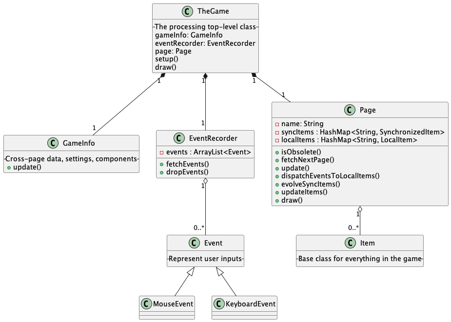

## Table of Contents
- [Members](#members)
- [Kanban Board](#project-kanban-board)
- [Introduction](#introduction)
- [Requirements](#requirements)
- [Design](#design)
  - [Class Diagram](#class-diagram)
  - [Communication Diagram](#communication-diagram)
  - [Sequence Diagram](#sequence-diagram)
  - [Design Summary](#system-architecture-summary)
- [Implementation](#implementation)
- [Evaluation](#evaluation)
  - [Qualitative Evaluations](#qualitative-evaluations)
  - [Quantitative Evaluations](#quantitative-evaluations)
  - [Testing](#how-our-code-was-tested)
- [Process](#process)
- [Conclusion](#conclusion)


## Members
Finn Lawton,
Haolan Zhao,
Daniel Parschau,
Yunpeng Yang,
Chao Gao


## Project Kanban Board

[Kanban](https://github.com/orgs/UoB-COMSM0110/projects/62)

## Introduction
Throughout this project we worked cohesively as a team and always had productive meetings. Even from the start of the development process we promptly decided to adapt a traditional arcade game. Collectively, we narrowed down our list to two games we spent our childhood playing: Pac-Man and Battle of the Tanks. After choosing these two games, it became clear that we could merge them together to create a novel twist. 

As the name indicates, Pac-Miner uses the classic Pac-Man style map with ghosts and powerups. However, Pac-Man has escaped their original habitat to retreat underground. Along the journey Pac-Man has gained the ability to release explosives which can kill ghosts and destroy walls, enabling the players to escape imminent death and create a route of their own choosing.


*Demonstrating our twist: the ability to destroy walls.*

One of our favourite aspects of playing games is competing against friends, as detailed in our user stories. Hence, we decided that the game would be exclusively multiplayer and we aimed to implement both local and online versions of the game. The game strategy differs depending on which the user chooses. In the local version, the players are able to see the entire map including their opponent, however in the online version a smaller area of the map is visible so the opponent and ghosts are not always visible.

<div style="display:flex;">
    
    
</div>

*Implementation of local (left) and online (right) multiplayer*

Both players compete against each other by collecting the coins generated throughout the map. Each player starts with 3 lives and aims to avoid ghosts while trying to outscore their opponent. Scattered in the map are uranium blocks which cause special events which can temporarily improve the players’ character or negatively affect their opponent. The game ends when one player loses all three of their lives. Players could target one another to score more points by killing their opponent or work peacefully and focus on collecting points instead.


## Requirements
### Ideation
We brainstormed a list of arcade style games and then discussed potential adaptations to create a novel concept. In this session, we described the basic premise of each game and narrowed our choices to: Tank and Pac-Man. To decide between the two, we discussed the technical challenges of each and created paper prototypes to envision the functionality of each game.

Following these sessions we realised that while both concepts were individually engaging there were a number of overlapping dimensions that might enable us to combine these into a single game. We decided on a version of Pac-Man with the ability to modify the map by means of explosive projectiles as shown in the paper prototype below.

[](https://www.youtube.com/watch?v=RZP7WlMi2Jo
"Game Idea: Pacman")

*Pac-Miner paper prototype.*

We then built a narrative involving our Pac-Man character fleeing underground from ghosts in arcade machines. Special events could be attributed nicely to the mutations and unexpected occurrences arising from the effects of uranium found underground. With additional potential for altering the game play mechanics through the effect of darkness underground and different types of mine wall materials. Throughout this process, we used Adobe Illustrator to create accurate mockups of the interface we would be building towards in the future.

[side by side images of adobe illustrator mockups]

#### Stakeholder Analysis
We were ready to start more actively thinking about the people that would be involved in using, building, maintaining and assessing the quality of our game by using the Onion Model:
1. Developers (Core Layer): We were responsible for designing, coding, and testing the game
2. Lecturers/Markers (Inner Layer): Critical in guiding the process and responsible for assessing the quality of the software that we produce, as a client would
3. Players (Middle Layer): The users who play the game during evaluation stages, providing valuable feedback on the game’s functionality and appeal
4. Customers (Outer Layer): In the event that the game is released beyond university
5. University as a negative stakeholder (Outer Layer): The school or university could be considered a negative stakeholder in the event of any issues that arise from the game which have an impact on the school’s reputation or resources (e.g. the online multiplayer gaming distracting students from work).

#### Development of User Stories
Considering these stakeholders we created functional requirements in the form of User Stories: 
1. As a player, I want to play against someone else so that I can spend time with my friend.
2. As a player, I want to achieve the highest score so that I can win the game.
3. As a player, I want to have clear directions on how to play the game so that I can understand the rules and controls.
4. As a developer, I want to know how to collaborate effectively with a team so that we can efficiently develop the game together.
5. As a lecturer, I want to be able to learn and play the game within five minutes so that I have a thorough understanding of the game mechanics.

Consulting these later in the process allowed us to identify missing functional elements that users had indicated would be important to them; including the user story stating that:

>As a player, I want to get the highest score so that I can win.

Which led us to discuss how we could increase competition. Driven by this motivation, we implemented a leaderboard that persisted in memory allowing a player to enjoy their achievement as desired.

Additionally, the following user requirement (relating to being able to easily understand how to play the game), was something we consistently tried to keep in mind and had feedback on in the later stages of the development process.

>As a player, I want to have directions on the game so I know how to play.

As such, from the start we had a tutorial page included. Reflecting reflecting on to the feedback received during evaluation, we improved the way in which instructions were presented by making them more visual. This feedback also led to the inclusion of text-based descriptions of the different special events that occur when the player collects uranium.

#### Multiplayer Use Case Specification and Diagram
We decided to develop a more in-depth use-case specification for the need to be able to share the gameplay experience with friends.

1. The first player (Player 1) opens the game and selects the option to create a new multiplayer game, which generates a unique room number.
2. Player 1 shares this room number with their friend (Player 2) via a chosen communication method.
3. Player 2 enters the room number in the designated field on their device to join the game.
4. The game establishes a connection between the two players' devices over the internet.
5. Player 1 selects the desired game mode and presses the 'Start' button to commence the game.
6. Both players now participate in the game concurrently, with their actions and movements synchronised in real-time.
7. The game interface updates continuously to reflect the players' scores, collected power-ups, and other relevant game statistics.
8. When Player 1's character is defeated, the game transitions their character to a 'ghost' state, allowing limited interaction with the game environment.
9. Similarly, when Player 2's character is defeated, the game concludes the current session and displays the final scores on a leaderboard.
10. Players are presented with an option to initiate a new game session.

We transformed the identified use-cases into a use case diagram to visually illustrate requirements and interactions within the game system.


Interestingly, as the project evolved we noticed that some of the functionalities did not contribute to the user experience as expected. This was true of the mechanism by which we had intended for players who died to turn into ghosts after they had lost all their lives.


## Design
At the beginning of this project, we allocated most of our time to designing the system architecture. This decision was made so that we could consider how we would implement the online multiplayer version without requiring a major code refactoring further into the project. This process was complicated and resulted in a long time deliberating and discussing the options before starting the minimum viable product (MVP), however, this approach has allowed our coding to be very structured and align with our three implementation challenges. A part of this initial design was creating the class and communication diagrams shown below.

The following sections briefly discuss the diagrams we created before code implementation before summarising the overall architecture of the final product.

### Class Diagram
As mentioned, this structure evolves around implementing the online multiplayer aspect of the game. Therefore, we have the classes: localItems and synchronisedItems which both extend Items. LocalItems would be used to implement objects which were only updated and displayed to the local computer, for example, buttons and labels. Conversely, SynchronisedItems were used to make objects which required updating on both server and client machines, for example, player icons, ghosts, walls and coins. 


*Final class diagram before implementation.*

### Communication Diagram
Our challenge to create an online multiplayer mode, meant that it was difficult to visualise the complex structure of the game. Therefore, we created a communication diagram to model the behaviour of our code; displaying the flow of data between the classes whilst the online multiplayer game mode is activated. This diagram focussed on how the two players connected over online multiplayer to interact with objects and how this is updated through the GameInfo class to synchronise with the other player.


*Final communication diagram before implementation.*

### Sequence Diagram
The following sequence diagram illustrates the method calls which take place during our game.


*Final sequence diagram before implementation*

### System Architecture Summary
Even though we spent time designing this architecture, we still made some changes during development. This is a natural consequence of the coding process, as evident in the paper by [LINK TO PAPER]. One such change was the implementation of different pages: start page, game page, end page. We have three top-level classes: Page, GameInfo and EventRecorder.

- A `Page` is what is displayed at the window. The game has different pages, e.g., home page, play page, game over page, etc. Each page comprises of various `Item`s. The current page is in charge of what will be the next page,
and when to switch to that page. Besides, in the implementation, every page (except for the home page) holds
a reference to its previous page, so that we actually have a page stack.

> *HomePage Class* - The first page of the game, users have the option to goto tutorial pages or proceed to start gameplay.
> 
> *HelpPage Classes* - Several help pages are used to alternate between visual instructions on how to play the game.
> *ModesPage Classes* - Local and online versions have different start pages as they require different information, such as choosing a single host of LAN online.
> 
> *PlayPage Class* - When the game is underway, this page ensures all items are behaving appropriately and the game state is synchronised for online game play.
> 
> *GameOverPage Class* - This page displays the leaderboard and which user won the game.

- `GameInfo` holds information that exists across different pages. For example, it holds the settings for window size and frame rate. This class is also necessary to provide pages for network interface.

- `EventRecorder` stores user input events: keyboard events and mouse events.



*Class diagram illustrating top three classes.*

**Item classes**

Items are drawn onto a page. They also react to user events and implement game logic.

Game logic is represented by the updates of items and the interactions between items. The top-level classes are in fact just a framework that deals with these updates and interactions.

Items are extend from either:
*LocalItem Class* - Implements items which are only needed on the local computer. For example the classes 'Button' and 'InputBox'.
*SychronizedItem Class* - Implements items which are synchronised to both client and server computers during game play. Some classes include 'Pacman', 'Wall', 'Coin' and 'PowerUp'.


*Class diagram illustrating Item inheritance*


## Implementation
### Challenge 1: Collision Engine
The collision engine is responsible for detecting and solving collisions between objects. For each step of evolvement, the solveCollisions method of the `CollisionEngine` class is called. It checks for each pair of items whether they overlap. However, this check won’t be taken between a pair of immovable items.

If the items do overlap, it’s considered a collision. Then the `onCollisionWith` method of each of the two items will be called.

Inside of the `onCollisionWith` method of a `MovableItem`, if the collision needs to be solved, the item’s `tryStepbackFrom` method or `tryPushbackFrom` method can be called. These two methods will correct the position of the item, eliminating the overlapping with the other item.

The `tryStepbackFrom` does the correction only if the collision is induced by the movement of the item during the evolution step. Also the correction won't be larger than the movement. So this method can’t handle collisions induced by resizement and overlapping induced by creation of new items. However, this method can handle collisions of multiple items consistently.

On the other hand, `tryPushbackFrom` corrects the position unconditionally if overlapping occurs. It is used for hard boundaries such as map border or Pac-Man shelter.

[INSERT GIF OF DIFFERENT COLLISION INSTANCES]

*Here we can see the collision of a Pac-Man and ghost results in the Pac-Man loosing a life.*

### Challenge 2: User Interface Design
This section outlines the design philosophy and approach our team adopted to create a user-friendly and intuitive user interface for our game. The great degree of complexity in the game greatly enhanced the difficulty of explaining to the user in a simple way how the game was to be played. 

We tackled this by iteratively improving the way in which the game instructions and layout were presented to the user by means of heuristic and think aloud assessments as described previously. Originally we had an extremely simple and quickly outdated view of the control instructions for the user as shown below. However, we noted that the inconsistent style of the background (intended to make the text easier to read actually created confusion with players thinking something had gone wrong with the programme). Additionally, the text that was used, while fun and reminiscent of arcade games, proved difficult to read. 

[First image]

*First implementation of help page: single page instruction.*

We then decided to change the simple single page screen of instructions to an extended version of this with scrollable instructions and a background consistent with that of the other options menus, as shown. 

[Second image]

*Next implementation of help page: scrollable screen.*

However this in itself introduced a number of other problems, namely that the scroll bar mechanic was not something  found elsewhere in the interface and thus proved to feel strange or complicated. We decided to remedy this by creating a mockup of a page based tutorial screen as follows:

[Third image]

*Next implementation of help page: alternating pages.*

Following this we realised that neat division of controls for movement as shown, would be improved by a further explanation and inclusion prior to starting of a game changing the interface as shown:

[Forth image]

*Including user instructions before starting the game.*

Furthermore the complexities of the multiplayer setup were simplified through minimalist design by (a) creating consistency between the the local and online pages (b) drawing attention to fields requiring user interaction through the use of bright white colours (c) colour delineated options inline with those used experienced in-game

[Fifth image]

*Clear display of information for online multiplayer setup.*

Finally we also enriched the tutorial pages by means of including the character icons which were being described. Ultimately this led to an easily understood user interface that was praised in further evaluation prior to the game day demo. 


### Challenge 3: Online Multiplayer
During online play, server and client handle their own local items respectively. But only the server is responsible for evolving synchronised items and synchronises them with the client. Each evolution step of synchronised items is achieved through the following processes:
- The user events from the client side are serialised and sent to the server side
- The server carries out all calculations for synchronised items
- The changes of the items are serialised by the server, sent to the client, and applied by client

[GIF OF SIDE BY SIDE ONLINE PLAY]

*Here we can see the two screens are synchronised in the online mode.*

There are three main difficulties:
1. *The serialisation protocol* -  we chose json string. It is simple but consumes a lot of network bandwidth. We also need to write a serialisation method for each of those event and item classes.
```
@Override
  public JSONObject getStateJson() {
    JSONObject json = super.getStateJson();
    json.setInt("strength", getStrength());
    return json;
  }
```

2. *Network programming* - we learned and used java nio selectable channel API. Besides, we added a cache layer to avoid frame locking between server and client. We have to employ SSH port forwarding to bypass the firewall of the lab machines.
  
3. *Consistent handling of page switches* - the server and the client may be on different pages before and after the game, but need to start and end the game simultaneously. So we handled a lot of different cases.


## Evaluation
We carried out evaluations at different points of the development process in order to have constant feedback and help navigate the final product design. This section will discuss the results.

### Qualitative Evalutations
After implementing initial features, such as the different pages and item initialisation, we performed our first qualitative assessment. We conducted a heuristic test with an external but well-informed third party. Importantly this was prior to the full implementation of the Collision Engine and meant that the user was severely restricted in their ability to fully assess the game.

Regardless, the assessment returned a number of helpful insights (summarised below). We identified critical issues related to a delay in player control and the inability to move through certain regions of space on the map. Furthermore, the lack of a prominent display of the current score meant that more comprehensive documentation was required.


*Heuristic evaluation.*

After some more time had passed and the game could be better assessed, we carried out another qualitative evaluation. Based on additional research, we found that hosting a focus group would be suitable. In this 40 minute session we asked five different participants the following questions.


*Focus group question and answers.*

The feedback from the focus group was valuable in showing personal user experience. It also highlighted that our twist to the traditional Pac-Man was evident, however, thematic analysis described below led to a number of features that we were able to implement:
1. Enhance Gameplay Experience
   - Increase the player experience by maintaining the aesthetic of the game.
   - Implement participant suggestions by adding diverse power-ups, enriching sound effects, and providing clearer help instructions.

2. Refine Game Mechanics and Features
   - Address technical issues such as improving frame rate visibility, resolving movement glitches associated with power-ups, and clarifying the functions of specific game elements like green items (powerups).
   - Enhance player understanding and interaction by detailing the list of power-ups and offering more intuitive in-game help resources.

3. Improve Visual and Aesthetic Aspects
   - Align visual expectations with reality by adjusting ghost movements and optimizing the game’s color scheme for better player reception.
   - Make visual improvements by enhancing font readability on help pages.

4. Optimize Player Interaction and Control
   - Simplify control mechanics to facilitate a smoother gameplay experience and improve player comprehension of game functionalities.
   - Increase interface accessibility by adding comprehensive help instructions at game start and incorporating a pause feature to enhance user interaction.

5. Strengthen Competitive Elements
   - Augment the competitive nature of the game by modifying scoring algorithms to reward ghost elimination and player-versus-player engagements more significantly.
   - Improve player differentiation and identification by having visual distinctions between characters.

### Quantitative Evaluations
We then assessed the workload level between our two game modes. A simple raw aggregate TLX was calculated between both of the game modes where individual scores were recorded from participants by means of a Google Forms survey. 

| Participant | Mental Demand | Physical Demand | Temporal Demand | Performance | Effort | Frustration | Aggregate Score |
|-------------|---------------|-----------------|-----------------|-------------|--------|--------------|-----------------|
| 1     | 30            | 0               | 60              | 30          | 55     | 55           | 38              |
| 2     | 45            | 0               | 25              | 30          | 40     | 0            | 23              |
| 3     | 75            | 5               | 15              | 0           | 30     | 0            | 21              |
| 4     | 70            | 15              | 45              | 30          | 70     | 35           | 44              |
| 5     | 40            | 0               | 40              | 20          | 40     | 15           | 26              |
| 6     | 40            | 15              | 55              | 60          | 75     | 10           | 43              |
| 7     | 65            | 15              | 45              | 85          | 55     | 15           | 47              |

*Raw NASA TLX results for local multiplayer*

| Participant | Mental Demand | Physical Demand | Temporal Demand | Performance | Effort | Frustration | Aggregate Score |
|-------------|---------------|-----------------|-----------------|-------------|--------|--------------|-----------------|
| 1     | 55            | 5               | 55              | 35          | 45     | 70           | 44              |
| 2     | 85            | 20              | 10              | 45          | 20     | 20           | 33              |
| 3     | 30            | 0               | 40              | 15          | 10     | 0            | 16              |
| 4     | 60            | 15              | 70              | 25          | 55     | 70           | 49              |
| 5     | 60            | 0               | 60              | 20          | 60     | 20           | 37              |
| 6     | 65            | 55              | 70              | 40          | 80     | 15           | 54              |
| 7     | 85            | 25              | 65              | 85          | 70     | 10           | 57              |

*Raw NASA TLX results for online multiplayer*

To validate whether there was a difference in perceived workload/difficulty we made use of the Wilcoxon Signed Rank test, which requires no assumptions regarding the distribution of the underlying scores. We found a W test statistic of 1.5 for a sample size of n=7. This was below the threshold of 2 and hence was significant at a p-value of 5%. This means that we are 95% certain that this is a real difference rather than due to randomness. Therefore, we concluded that the online version required a higher workload than the local mode. We discussed that the inability to see the entire map in online mode as well as the darkened screen surrounding the character resulted in a more challenging experience.

### How our code was tested
To ensure the robustness of our game code, we conducted unit tests on key functionalities. Given the complexity of the game system, we focused our testing efforts on collision solving and the PowerUp features. The collision solving tests check whether collisions are detected and solved correctly. The PowerUp tests check whether various PowerUps, once acquired by Pacman, alter its state and behaviour as expected. For instance, we tested the Opponent Control, Time Freeze, and Speed Surge PowerUps to verify if they correctly change critical attributes such as Pacman's speed and control key set. Additionally, we tested the Size Modification and Trap PowerUps to ensure that these items effectively impact both Pacman and Ghosts, although our tests primarily focused on Pacman. By employing assertions, we confirmed that when Pacman_1 acquires a Trap PowerUp and sets a trap, any Pacman_2 or Ghost triggering the trap should decelerate. These tests validate the functionality and applicability of the PowerUp items, thereby enhancing the consistency and predictability of the gaming experience.

We also conducted black box tests. After each merge, the game would be tested to check whether it conforms to the requirements and designs. For example, in a test we found that the Pac-Man could not fire while moving, which was not the desired behaviour. After checking the code, it was found that the Pacman collided with its own bullet and the bullet was then deleted. This bug was solved by identifying the owner of the bullet before deleting it.


## Process
In developing our game, our goal was to create not only an enjoyable and engaging experience for players but also to thoroughly understand and apply the principles of good software engineering. To achieve this, our team embraced the Agile methodology and integrated its key principles into our workflow.

Our team consisted of 5 members and we worked effectively and directed our focus on whatever was most helpful in the moment. However, despite this flexibility we also held fairly consistent responsibilities as per the following breakdown

> Yunpeng Yang, Lead Developer
>
> Finn Lawton, Front End Developer
>
> Haolan Zhao, Backend Developer
>
> Daniel Parschau, Front End Developer
>
> Chao Gao, Backend Developer


Our Agile approach involved dividing the project into three life cycles, representing different phases or major milestones. Each life cycle included sprints where we iteratively developed features, fixed bugs, and made improvements. These cycles can largely be categorised as follows: Framework Creation, MVP Development, Improvements & Finalisation.

We did not hold daily stand-up meetings but stayed in constant communication through platforms like WhatsApp and Microsoft Teams. This allowed us to address obstacles swiftly, support each other, and share progress updates.
Our team also engaged in pair programming sessions to enhance code quality and knowledge sharing. This was particularly useful in the first cycle as we were familiarising ourselves with the OOP paradigm and learning to use Processing in particular.

Early in the project, we established a WhatsApp group for swift and informal discussions. This decision came after initially trying out Microsoft Teams and finding it didn't meet everyone's preference for quick communication. The WhatsApp group proved to be an invaluable tool for rapid exchanges and coordinating small tasks.

Our discussions also extended to GitHub, particularly within pull requests. We adopted the trunk-based branching model, and carried out code review for each pull request. This platform allowed for more structured and in-depth conversations around code changes and potential issues. For substantial matters or broader discussions that required more in-depth conversation and brainstorming, we convened weekly meetings at the Merchant Ventures Building.

We initially implemented a Kanban board to break down and allocate tasks. However, its use varied; at times, it was bypassed due to the efficiency of in-person or instantaneous text-based discussions. Despite this fluctuation in utilisation, the Kanban board served as an excellent visual tool for tracking progress when employed.
During one of the holiday periods, when in-person meetings were not feasible, we coordinated over video calls. We encountered challenges with both Zoom and Teams during this time and ultimately found success with an impromptu WhatsApp video call, which catered perfectly to our needs.

[Kanban board]

*The Kanban board we used during implementation*

Our work on the game was consistent throughout the project timeframe. However, there were notable spikes in the additions to the codebase, primarily during two main sprints. The first spike occurred prior to workshops on different testing methods, and the second was close to the Easter break, when more time was available for development. These periods of intense activity are clearly reflected in the frequency graphs, illustrating our project's dynamic nature and our team's ability to intensify efforts when necessary.

[Additions and Deletions grap]

*Graph depicting our three sprints.*

By maintaining flexible communication channels and a versatile approach to project management, we were able to navigate through various challenges, including the holiday period, effectively. This adaptability was pivotal to our project's success, ensuring continuous progress and collaboration.


## Conclusion
In conclusion, we have created a fully functional adaptation of the well known Pac-Man game. The novel features of multiplayer, destructible walls and power ups, allows for an engaging and competitive game. Our system architecture was carefully designed using GameInfo, Page and EventRecorder classes to allow for the implementation of the online multiplayer game mode. This project has not only produced an entertaining game to play but also provided valuable insights and reflections on the software engineering process.

As discussed in this report, central to our development approach was the decision to prioritise the implementation of the online multiplayer challenge and design the system architecture accordingly. This facilitated efficient development workflows and minimised the need for extensive code refactoring later in the process. However, this also caused potential constraints, limiting the flexibility of the code composition and sometimes adding an extra challenge when adapting to evolving requirements. This illustrates the delicate balance between planning for future scalability and maintaining agility in development.

Throughout the project, we learned invaluable lessons in task allocation and communication methodologies. By assigning specific responsibilities to individual team members, we could maximise productivity. We also discovered the benefits of arranging in person over online meetings. When meeting in person, it was easier to discuss the project and our tasks without the additional challenge of technological issues.

One notable challenge we encountered during evaluations revolved around making succinct help instructions for our intricate game mechanics. Given the complexity of the gameplay dynamics, ensuring the presence of essential guidance in a clear and concise format proved to be a challenge. This highlighted the importance of user-centric design principles and effective help and documentation as one of Nielson’s 10 Heuristics.

Looking towards the future, there are many potential enhancements and features that we have discussed to further add to the gaming experience. For instance, integrating pause buttons would allow players greater control and convenience during sessions. We could also introduce a ghost transformation mechanism, where when the first player dies they turn into a ghost which can target the surviving opponent, allowing for more competition. We understand the evolving nature of software engineering projects, and would aim to meet the expectations and requirements of the end users.

## Individual Contribution Table
| Name           | Role               | Individual Weight |
|----------------|--------------------|-------------------|
| Yunpeng Yang   | Lead Developer     | 1.0               |
| Finn Lawton    | Front End Developer| 1.0               |
| Haolan Zhao    | Backend Developer  | 1.0               |
| Daniel Parschau| Front End Developer| 1.0               |
| Chao Gao       | Backend Developer  | 1.0               |
