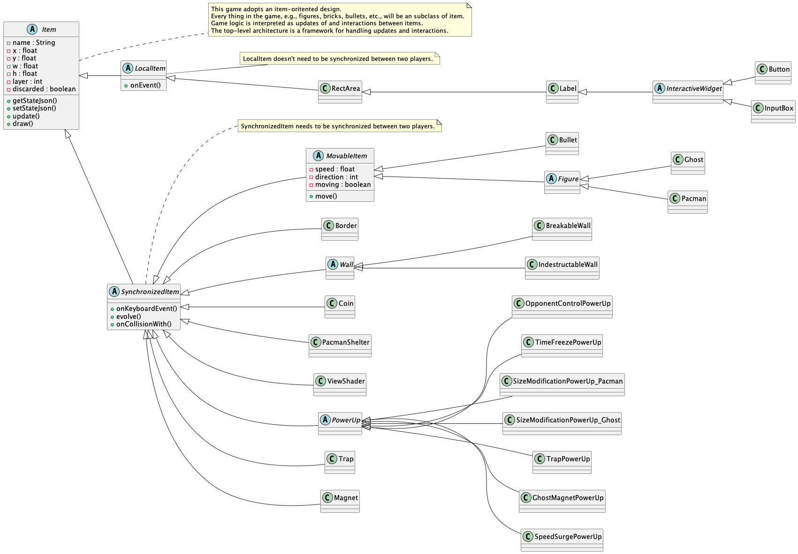

# Basic Classes and Overall Architecture

## Basic Classes

### Top-level classes

Three top-level classes are `Page`, `GameInfo`, and `EventRecorder`.

- A `Page` is what is displayed at the window.
The game has different pages, e.g., home page, play page, game over page, etc.
Each page comprises of various `Item`s.

- `GameInfo` holds information that exists across different pages.

- `EventRecorder` stores user input events: keyboard events and mouse events.

### Item classes

`Item`s make up a page.
They are drawn on the page.
They also react to user events and implement game logic.

Game logic is represented by the updates of items and
by the interactions between items.
The top-level classes are in fact just a framework that
deals with these updates and interactions.

## Game Framework Work Sequence

## Consideration: How to Store and Manage All the Items

### map-oriented

Items are arranged by their spatial positions in some "map" object.
Item may not need a position attribute.
For example, in some simple cases, map is a cell array,
and cell holds items.

- Easy to find out whether a particular position is occupied,
and by which item it is occupied.

- Difficult to list items or to retrieve a specific item.

### item-oriented

Items are managed by some list or hash.
Item needs a position attribute.

This method is what we've chosen.

- Easy to retrieve items.

- Difficult to deal with spatial problems,
e.g., what items are in the neighbour of a specific item.

### hybrid

Uses list/hash to hold items,
as well as a spatial map as a helper class.
